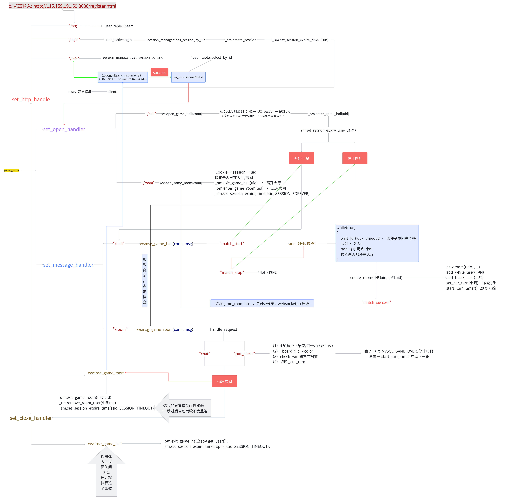
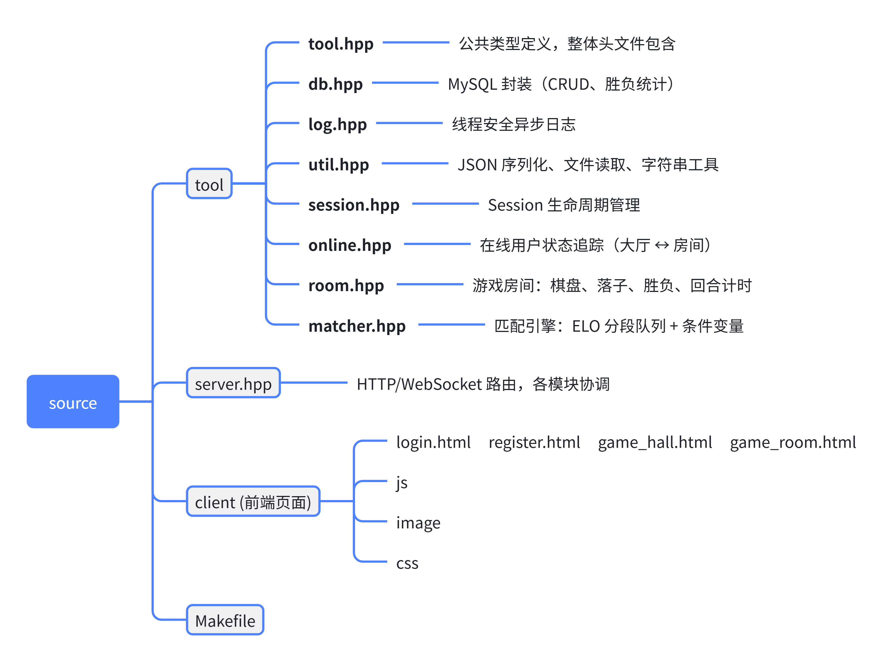
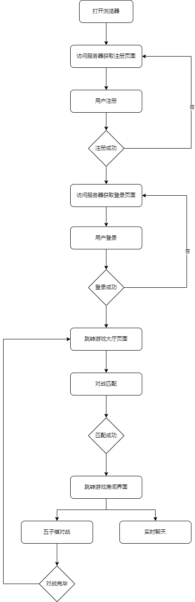

# Gobang — 基于 WebSocket 的 C++ 实时多人五子棋对战服务器

从零构建的 C++17 多人实时五子棋服务器，单端口复用 HTTP + WebSocket，支持注册登录、Session 管理、ELO 分级匹配、回合制走棋、聊天、超时自动落子。

## 架构



## 技术栈

| 层次 | 技术 |
|------|------|
| 语言 | C++17 |
| 构建 | GNU Make |
| 网络 | websocketpp（单端口 HTTP + WebSocket 同服务）|
| 序列化 | jsoncpp |
| 数据库 | MySQL（C API libmysqlclient）|
| 并发 | std::thread + std::mutex + std::condition_variable |
| 前端 | 原生 HTML/CSS/JS + Canvas + jQuery Ajax |

## 项目结构（~1900 行）



## 核心功能与设计要点

### 1. 单端口复用 HTTP + WebSocket

websocketpp 在握手阶段识别 `Upgrade` 头，将 HTTP 升级为 WebSocket，不需要开两个端口。鉴权走短连接 HTTP，游戏实时通信用长连接 WebSocket，职责分离。

### 2. Session 生命周期管理

```
登录 → 创建 Session（30 秒倒计时）
  └─ 连 WS /hall 或 /room → Session 设为永久
      └─ 断开 → 重置 30 秒倒计时
          ├─ 30 秒内重连 → 恢复
          └─ 超时 → 自动销毁
```

- Session ID 通过 `Set-Cookie: SSID=xxx` 写入浏览器，后续请求自动携带
- 活跃连接时 Session 永久有效，断开后 30 秒自动回收，防止内存泄漏
- 登录时遍历已有 Session 检测重复登录，拒绝同一账号多处登录

### 3. 匹配引擎

- 三个 ELO 分段队列（青铜 < 2000 / 白银 2000~3000 / 黄金 > 3000），各由独立线程驱动
- 使用 `std::condition_variable::wait_for()` 阻塞等待，队列空时零 CPU 开销
- 匹配成功后二次校验双方仍在线，任一环节失败则回滚，不丢人

### 4. 回合走棋

- 15×15 棋盘，白方先手，`_cur_turn` 控制回合，非当前回合玩家的落子请求被拒绝
- 胜负判定：从落子点出发，沿水平、垂直、两条对角线共 4 个方向双向扫描，每次 O(1)
- 掉线处理：对局中任意一方断开连接视为认输，对方直接获胜并写库

### 5. 20 秒思考倒计时

- 每回合启动 ASIO 定时器，超时自动扫描棋盘第一个空位落子
- 定时器回调捕获创建时的 `_cur_turn` 值，触发时做三道检查：错误码、对局状态、回合是否切换
- 避免因取消旧定时器导致的 ASIO 回调竞态

## 编译运行

### 依赖

```bash
sudo apt install g++ make libmysqlclient-dev libjsoncpp-dev libboost-system-dev libwebsocketpp-dev
```

### 建库

```bash
mysql -u 用户名 -p < source/tool/db.sql
```

### 配置数据库连接

修改 `source/main.cpp`：

```cpp
gobang_server srv("127.0.0.1", "用户名", "你的密码", "gobang", 3306);
```

### 编译启动

```bash
make server    # 编译
./server       # 启动，监听 8080 端口
```

浏览器打开 `http://115.159.191.59:8080/login.html`。（云服务器地址）


## 对局流程


